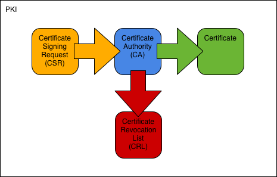

# using-open-ssl
Overview SSL

[TOC]

## OpenSSL and SSL's structure

First things first, let's talk about structure!

OpenSSL is an open-source implementation of SSL -- Secure Socket Layer. SSL is used on the Internet to secure connections. To be exact, TLS -- Transport Layer Security -- is used, but TLS is a web standard, that implements SSL.

SSL is used to authenticate a server using its certificate, and to establish a session-specific cipher key using Deffie-Hellmann Key Exchange and the server's public key. Note, that SSL can also be used to authenticate a client.

The certificate and a private key comprise the cryptographic identity of the server.

In order to authenticate the server as being, who it claims to be, the server's certificate must be authenticated. To make this possible a certificate is signed by a Certificate Authority (CA), which is basically another certificate, but one with CA rights.

By chaining CAs one creates a Certificate Chain. At the one end of this chain sits the Domain Level or End Entitiy Certificate, which is the server's certificate. At the other end sits the Root CA, which is a certificate issued by a Trusted Authority (usually a company). You just have to trust a Root CA or self-signed certificate. The certificates in between are called Intermediate CAs, although the CA that signed the Domain Certificate can also be referred to as the Signing CA.

Here's a quick overview I stole from Readthedocs:

**Components**

- Public Key Infrastructure (PKI)
  - Security architecture where trust is conveyed through the signature of a trusted CA.
- Certificate Authority (CA)
  - Entity issuing certificates and CRLs.
- Registration Authority (RA)
  - Entity handling PKI enrollment. May be identical with the CA.
- Certificate
  - Public key and ID bound by a CA signature.
- Certificate Signing Request (CSR)
  - Request for certification. Contains public key and ID to be certified.
- Certificate Revocation List (CRL)
  - List of revoked certificates. Issued by a CA at regular intervals.
- Certification Practice Statement (CPS)
  - Document describing structure and processes of a CA.

**CA Types**

- Root CA
  - CA at the root of a PKI hierarchy. Issues only CA certificates.
- Intermediate CA
  - CA below the root CA but not a signing CA. Issues only CA certificates.
- Signing CA
  - CA at the bottom of a PKI hierarchy. Issues only user certificates.

**Certificate Types**

- CA Certificate
  - Certificate of a CA. Used to sign certificates and CRLs.
- Root Certificate
  - Self-signed CA certificate at the root of a PKI hierarchy. Serves as the PKI’s trust anchor.
- Cross Certificate
  - CA certificate issued by a CA external to the primary PKI hierarchy. Used to connect two PKIs and thus usually comes in pairs. [1]
- User Certificate
  - End-user certificate issued for one or more purposes: email-protection, server-auth, client-auth, code-signing, etc. A user certificate cannot sign other certificates.

**Recap** A PKI as created by a CA looks like this:  
Root CA → Intermediate CA → Intermediate CA → Signing CA → Domain Certificate

## Making Certificates

Now let's talk about, how to make certificates -- the process, that is.

Generally you start by making an RSA Key to serve as the certificate's private key.  
Then you create a Certificate Signing Request (CSR), which contains a lot of relevant information about the certificate.  
Then you consult a CA to sign the CSR, which creates the valid certificate (CRT).

In the case of Root CAs, which are signed by themselves, you can technically do the same, but you can also just use a shortcut the command, that creates the CSRs, provides.

Basically (again from Readthedocs):



## OpenSSL, the application

On Linux the OpenSSL command is used for certificate management. On mac it's LibreSSL and Microsoft have their own implementation as well, but let's use OpenSSL, shall we?

It should be said here, that the OpenSSL implements commands for creating and managing Certificates, but also for generating cipher keys, encrypting and decrpyting with a host of cipher algorhithms, both symmetrical and asymmetrical ones. This can be usefull for encrypting files in any context (eg on disk).

OpenSSL is an interactive shell, so it provides commands, which take arguments of their own. If you need the man page for a command
```
man openssl-COMMANDNAME
```
usually does the trick.

OpenSSL commands usually take an input and have an output. Sometimes flags need to be specified about the input or output. Often other parameters are added about the functionality and to provide information to the program.

#### Generating an RSA Key
```
openssl genrsa -out FILENAME.key LENGTH
```
creates an RSA key. The LENGTH attribute tells genrsa how long the key should be in bits. For SSL 2048 is usually a good number.

You can also provide your own random seed with the `-rand` flag. *See genrsa -help*

#### Making a Self-Signed / Root Certificate

```
openssl req -x509 -new -out FILENAME.crt -keyout FILENAME.key -days NUMBER
```
creates a root certificate and a corresponding key and authorizes the certificate for NUMBER days.  
The `-days` flag is optional.

`req` stands for request. `x509` tells `req` to create a self-signed certificate.

```
openssl req -x509 -new -out FILENAME.crt -key FILENAME.key
```
creates a root certificate using the key in FILENAME.key


#### Making an Intermediate CA

Creating Intermediate CAs, Signing CAs and Domain Certificates is much simpler, if you are using configuration files.
You can input all the relevant data with just the command's flags, but trust me, you don't want to.

*Note: You can also make such configs for your Root CA and sign it with the `openssl x509 -signkey FILENAME` option. Look to the manpage for more!*

Config file for an Intermediate CA
```
[ req ]
default_bits 		= 2048		# length of key
prompt 			= no		# don't ask for any more info on command line
default_md 		= sha256	# cryptographic algorithm to use
distinguished_name 	= dn		# used to identify the CA

[ dn ]
C=DE                          	# Country key
ST=Schleswig-Holstein         	# State key
L=Schleswig                   	# City key
O="Dune Corp"                 	# Organization Name
OU="Dune Corp CA Issuer Unit" 	# Organizational Unit Name
emailAddress=preacher@dune.com	# email
```

##### req Configurations
```
fi = value			# comments
field		=value		# whitespace doesn't matter
field2	= sub:value,sub:value	# sometimes multiple subFields need to be filled with values (separate fields with ',', assign with ':')
longerField	= section_name	# reference a section

[ section_name ]
subField1 = value		# in a section you can assign the subFields with the regular '=' syntax
subField2 = value		# you don't need no commas or colons!

[ default ]			# the default section is read by all commands, that take the config file
varName = value			# you can bind variables in here, and use them in other sections
notherVarName = value
someField = $varName$notherVarName	# the variable syntax is posix

[ req ]				# section that is to be read by the `req` command in openssl
[ca]				# (whitespace, eh?) section that is to be read by the `ca` command in openssl
```

```
openssl req -new -out FILENAME.csr -inkey FILENAME.key -config FILENAME.config
```
creates a CSR with the given settings

With version 3 of x509 (x509v3) Extensions became a possible thing. These are used to specifiy a certificate's purpose, and to identify authorizing certificates (the issuing/signing CA) and subjects (eg a domain).

I found the easiest way to use these, is to put them in a separate file
```
authorityKeyIdentifier=keyid,issuer	# used to identify the authorizing CA
basicConstraints=CA:TRUE,pathlen:10	# CA:TRUE means certificate is a CA, pathlen:n allows n certificates in the certificate chain between this CA and a Domain Certificate
keyUsage = keyCertSign			# what is this certificate used for?
```

```
openssl x509 -req -in FILENAME.csr -out FILENAME.crt -extfile FILENAME.ext -CA CA.crt -CAkey CA.key -CAcreateserial
```
creates a signed certificate from the provided csr

`x509` creates x509-certificates  
`extfile` provides a file with x509v3 extensions (as discussed above)  
`CA` "Certificate Authority", the signing certificate  
`CAkey` the private key of the signing certificate  
`CAcreateserial` creates a serial number for the signed certificate, or increments existing serial

*Note: each signed certificate has a serial number, each singing CA has the next serial number in a CA.srl file with it*

#### Making a Signing CA

Same as Intermediate CA, only the pathlen is 0 because the Signing CA can't issue CAs, only Domain Certificates.

#### Making a Domain Certificate

Config file
```
[ req ]
default_bits = 2048		# length of key
prompt = no			# don't ask for any more info on command line
default_md = sha256		# cryptographic algorithm to use
distinguished_name = dn		# used to identify the CA

[ dn ]
C=DE                          	# Country key
ST=Schleswig-Holstein         	# State key
L=Schleswig                   	# City key
O="Dune Corp"                 	# Organization Name
OU="Dune Corp CA Issuer Unit" 	# Organizational Unit Name
emailAddress=preacher@dune.com	# email
CN = www.gsbheinen.com		# Common Name, the associated domain name; can also be a wildcard, eg *.example.com instead of www.example.com
# ...				  this can feature lots of things, these parameters are used for identification after all
#				  eg if you are a company functioning as its own CA, you'll want to keep track of your certificates properly
```

x509v3 Extensions file
```
authorityKeyIdentifier	= keyid,issuer
basicConstraints	= CA:FALSE			# a Domain Certificate is NOT a CA
subjectAltName 		= @alt_names			# other associated Domain Names
keyUsage 		= digitalSignature, nonRepudiation, keyEncipherment, dataEncipherment		# these are the big uses for Domain Certs
extendedKeyUsage	= serverAuth,clientAuth		# OPTIONAL for more specifications (like this one for TLS but emailProtection,clientAuth for email)

[ alt_names ]
DNS.0 = gsbheinen.com
DNS.1 = gsbheinen.de
DNS.2 = www.gsbheinen.com
DNS.3 = www.gsbheinen.de
DNS.4 = *.gsbheinen.com
```

The commands to use are the same.

## Suggested file structure

It's convenient to have these folders:
```
./
./config	# put the config and x509v3_ext files here
./key		# put the keys here
./crt		# put the certificates here
./csr		# put the certificate signing requests here
```

Then the commands are:

#### Root CA  
Make Root CA with a seperately generated Key
```
openssl genrsa -out ./key/rootCA.key 2048
openssl req -x509 -new -out ./crt/rootCA.crt -key ./key/rootCA.key -days NNNN
```

#### Intermediate CA  
Make Intermediate CA Request with a seperately generated Key
```
openssl genrsa -out ./key/intermediateCA.key 2048
openssl req -new -config ./config/intermediateCA.config -out ./csr/intermediateCA.csr -inkey ./key/intermediateCA.key
```

Make Intermediate CA Request AND generate Key
```
openssl req -new -config ./config/intermediateCA.config -out ./csr/intermediateCA.csr -keyout ./key/intermediateCA.key
```

Sign Request
```
openssl x509 -req -in ./csr/intermediateCA.csr -extfile ./config/intermediateCA.ext -out ./csr/intermediateCA.crt -CA ./crt/rootCA.crt -CAkey ./key/rootCA.key -CAcreateserial -days NNNN
```

#### Signing CA  
Make Signing CA Request with a seperately generated Key
```
openssl genrsa -out ./key/signingCA.key 2048
openssl req -new -config ./config/signingCA.config -out ./csr/signingCA.csr -inkey ./key/signingCA.key
```

Make Signing CA Request AND generate Key
```
openssl req -new -config ./config/signingCA.config -out ./csr/signingCA.csr -keyout ./key/signingCA.key
```

Sign Request
```
openssl x509 -req -in ./csr/signingCA.csr -extfile ./config/signingCA.ext -out ./csr/signingCA.crt -CA ./crt/intermediateCA.crt -CAkey ./key/intermediateCA.key -CAcreateserial -days NNNN
```

#### Domain CA
Make Domain CA Request with a seperately generated Key
```
openssl genrsa -out ./key/domainName.key 2048
openssl req -new -config ./config/domainName.config -out ./csr/domainName.csr -inkey ./key/domainName.key
```

Make Domain CA Request AND generate Key
```
openssl req -new -config ./config/domainName.config -out ./csr/domainName.csr -keyout ./key/domainName.key
```

Sign Request
```
openssl x509 -req -in ./csr/domainName.csr -extfile ./config/domainName.ext -out ./csr/domainName.crt -CA ./crt/signingCA.crt -CAkey ./key/signingCA.key -CAcreateserial -days NNNN
```

## PKCS12
PKCS12 is an encoding format for Certificate chains. It takes as input the Signing and Intermediate Certificates, as well as the domain Certificate and its private key and bunches all of those into one neat file, that for example `native_tls` for rust can read.

```
openssl pkcs12 -export -in FILENAME.crt -key FILENAME.key -out FILENAME.pkcs12
```
Note that in FILENAME.crt **all** Certificates of the Certificate chain to the domain Certificate must be stored.  
Since Certificates in PEM encoding (that's the default) have a start and end delimiter (-----BEGIN CERTIFICATE-----, -----END CERTIFICATE-----), you can just copy all Certs up to a CA (Root or otherwise) that is known by clients (browsers/OSs) into one file. The order is irrelevant.

## Using custom Certificates for projects

To authorize a Certificate a browser or OS needs to have access to the CA, that signed it. It either knows this CA already, cause you added it to the browser/OS (if it is a custom one, that is) or the CAs up to a known CA are added into a pkcs12 as a chain.  

<a style="color:red">**You have to provide a complete Certificate Chain up to a Cert that is known by the target machine!
You have to add at least the Root CA to the browsers/OSs in question!**</a>

For small projects this means it's easiest to just have a Root CA and use that as your Signing CA. (Those can be the same).  
`Root CA → Domain CA`

### How it's done on the Web

On the internet certificate issuers are usually not known to browsers. In x509v3 there is an extension to fix that!
```
authorityInfoAccess=ocsp_section

[ ocsp_section ]
caIssuers;URI.0 = "https://www.quack-a-doodle.io/CA.crt"	# URI to the Certificate
caIssuers;URI.1 = "https://www.example.com/certificate.crt"	# another URI to the Certificate
OCSP;URI.0 = "http://www.quack-a-quockle.co.uk/OCSP/"		# URI to OCSP service -- Online Certificate Status Protocol
```
Providing multiple URIs is insurance, one server goes down.
You don't have to have OCSP and caIssuers.

## References and helps

For more on the available x509v3 extensions look to `man x509v3_config`.  
For more on the req config files see `man openssl-req` under the CONFIGURATION FILE FORMAT section.

In this repository a full set of example configuration files can be found.
These are basically copied from Readthedocs, and then slightly altered, because their's were for `openssl ca`, which is a more general management tool for lots of certificates. The commands on this page do the same thing, but they are more work, if you have lots of CSRs to sign. `openssl ca` takes away some of that work, but it expects more comlete configs.

If you want to make certificates, use the example configs and the commands on this page (though you might have to tweak the parameters for the filenames).

To learn more, read the Info.md file, which I forked from a Gist of some dude. It explains a lot about how the certs are structured.  
To learn more about PKI Management (with `openssl ca`) read: [OpenSSL PKI Tutorial](https://pki-tutorial.readthedocs.io/en/latest/simple/server.conf.html)  
That latter one is very comprehensive.

Be careful to actually ***READ*** those documents, because they are comprehensive *only* if you read **carefully**! TRUST ME, read them as if you knew NOTHING, it's EASIER!!!
